# Auto-Learn Pro Introduction
Auto-Learn Pro is a machine learning Android application for our Fundamentals of Software Engineering class.

**REVISION 05/17/2020 ** Auto-Learn has been renamed to Auto-Learn Pro. 

 Eventually, there will be a total of 12 Classifications:
             
             * Estate/Wagon
             
             * Minivan
             
             * Hardtop Convertible
             
             * Motorcycle
             
             * Bus
             
             * SUV
             
             * Truck
             
             * Soft-top Convertible
             
             * Van
             
             * Saloon/Sedan
             
             * Coupe
             
             * Hatchback

Collaborators to this repository include:

**Edrik Aguilera (https://github.com/driko-development)**

**William Anderson (https://github.com/willpanderson)**

**Ryan Laurents (https://github.com/laurentsR)** 

GitHub was used to host our git repository, it contains the following items:

* **AutoLearnApp** - Android studio project
* **Documentation** - Project Documentation
* **Machine Learning** - Dataset and ML material
* **README.md** - Project description and instructions

Please follow the instructions below to get started testing our application.
When testing our application ensure that the **minimum Android version** is set to **7.0.0 Nougat**
(API level 24). We recommend using a **Nexus 5X** emulator for testing.

Physical devices that have been used to test our application include:
* **Galaxy Tab A 8.0**
* **Galaxy S8 Active**
* **Galaxy S7 Edge**

# AutoLearnApp
### Prerequisites
* **Android Studio** must be installed ([Installation Instructions](https://developer.android.com/studio))
* **Git** must be installed ([Installation Instructions](https://git-scm.com/book/en/v2/Getting-Started-Installing-Git))

### Cloning the repository
#### Windows
From the cmd prompt or PowerShell type in the instruction 
**git clone https://github.com/willpanderson/Auto-Learn-Pro.git**
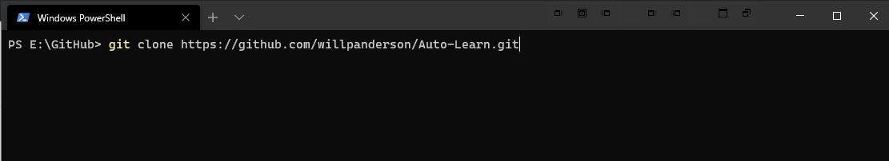  

Verify that you have the contents of the repository by listing the directory
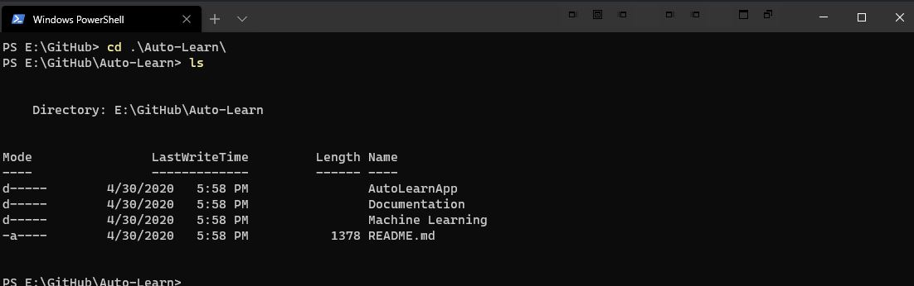

#### Linux
From the terminal type in the instruction
**git clone https://github.com/willpanderson/Auto-Learn-Pro.git**
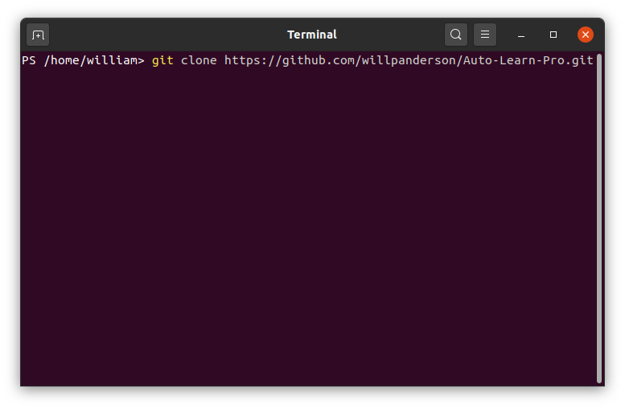

Verify that you have the contents of the repository by listing the directory
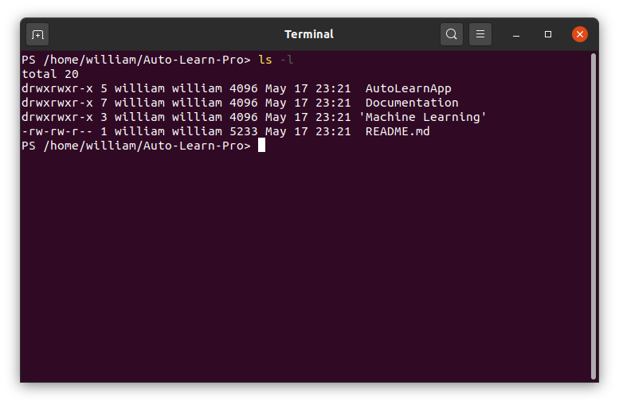

### Launching the Android Application
1. Launch Android Studio    
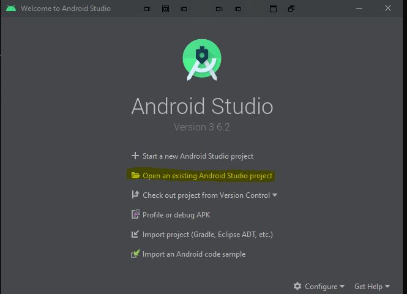

2. Select **Open an Existing Android project** and navigate to the directory listed before 
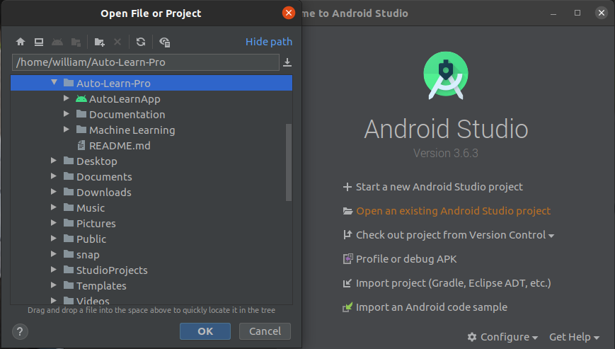

3. Click on the Android project denoted by the green **Android Logo** and hit **OK**    

4. Load an emulated device or connect a device (**Nexus 5x recommended**)  
  

<b>Instructions for Emulated Device</b>

  
  1. From the Android Studio application, up at the top select **No Devices**
  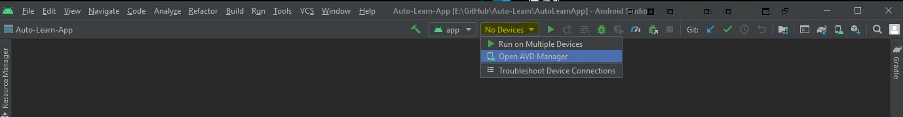
  
  2. Select **Open AVD Manager**
  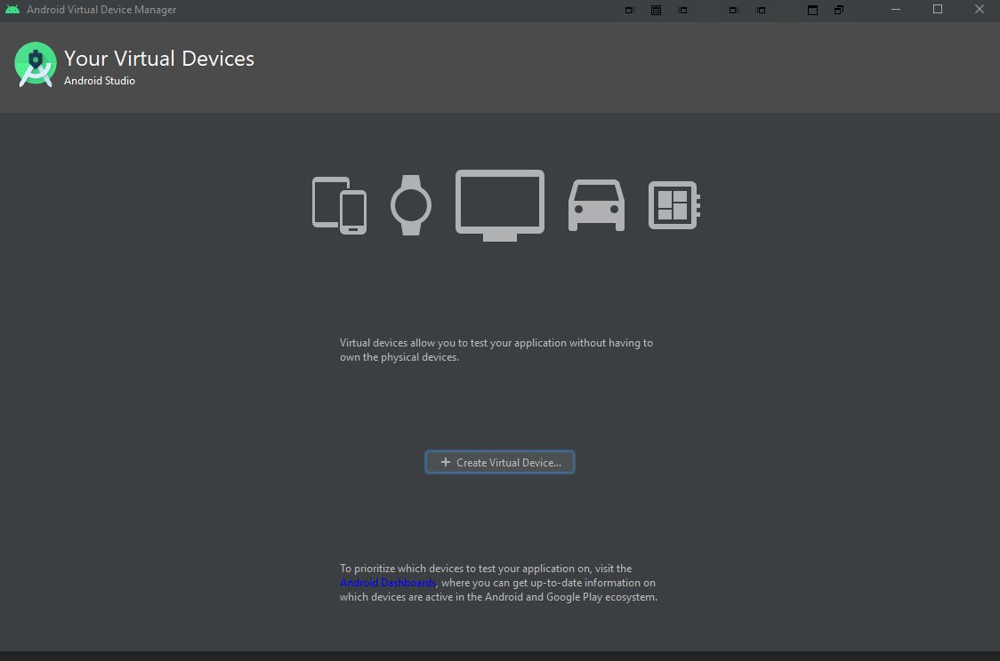
 
  3. From Device Manager select **Create Virtual Device**     
  
  4. Select a device (**Nexus 5X** for testing purposes) and click **Next**
  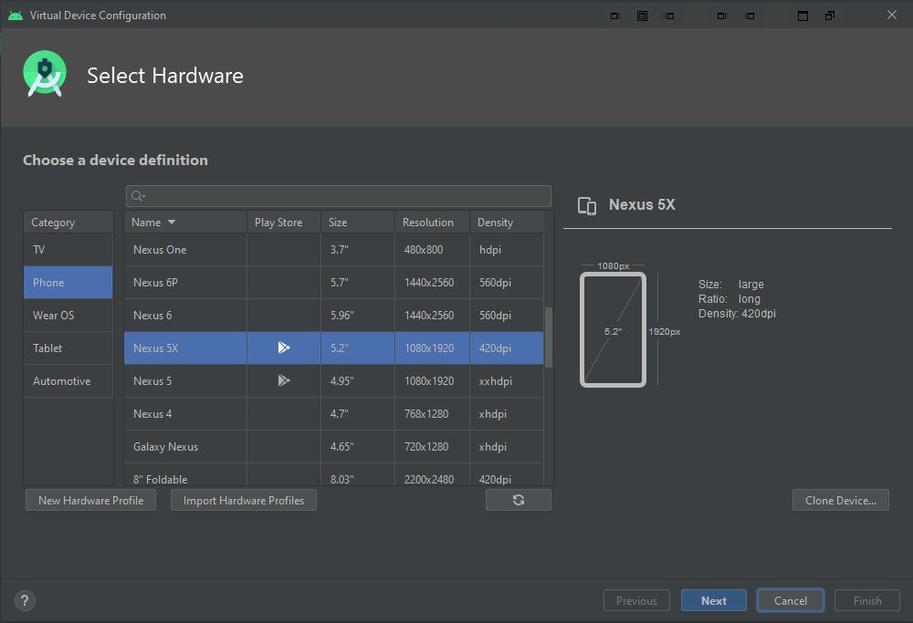
  
  5. Choose Android version (**Nougat 7.0 minimum**) and click **Next**
  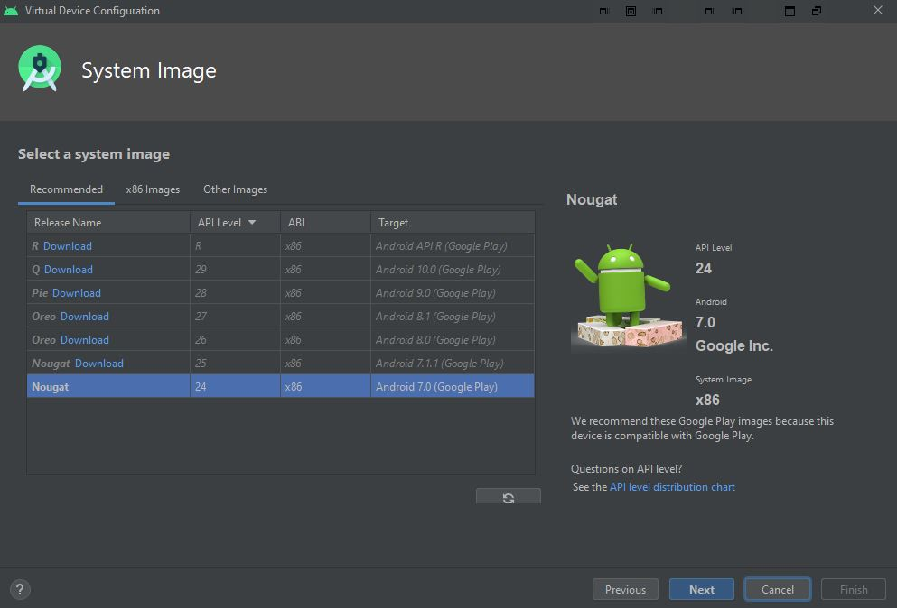
  
  6. Keep default settings and press **Finish**
  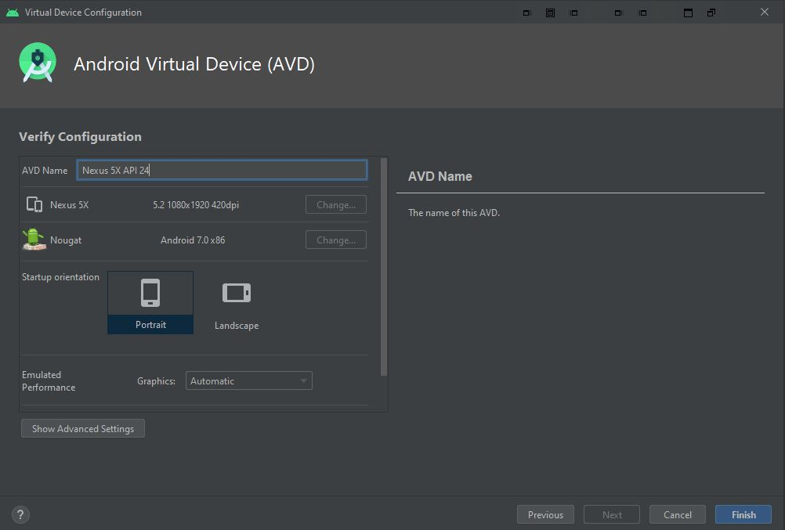
  
  7. If the virtual device was created it will be displayed in the Device Manager
  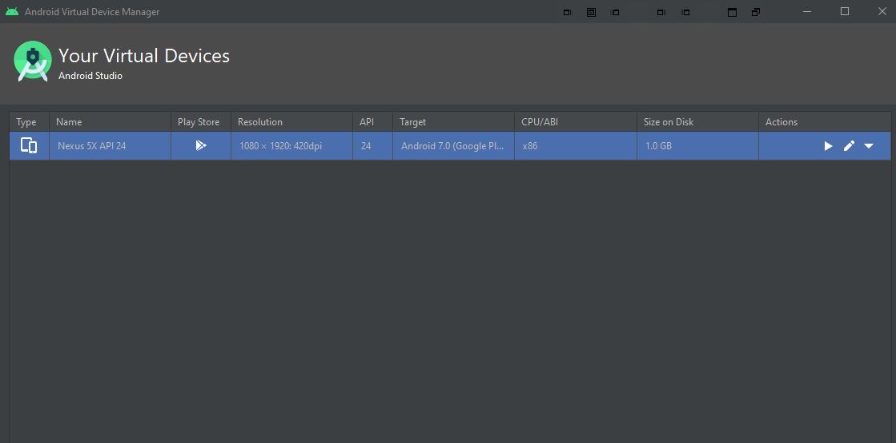
    

    

5. Select **Run 'app'** denoted by the Green arrow (Shift+F10)    
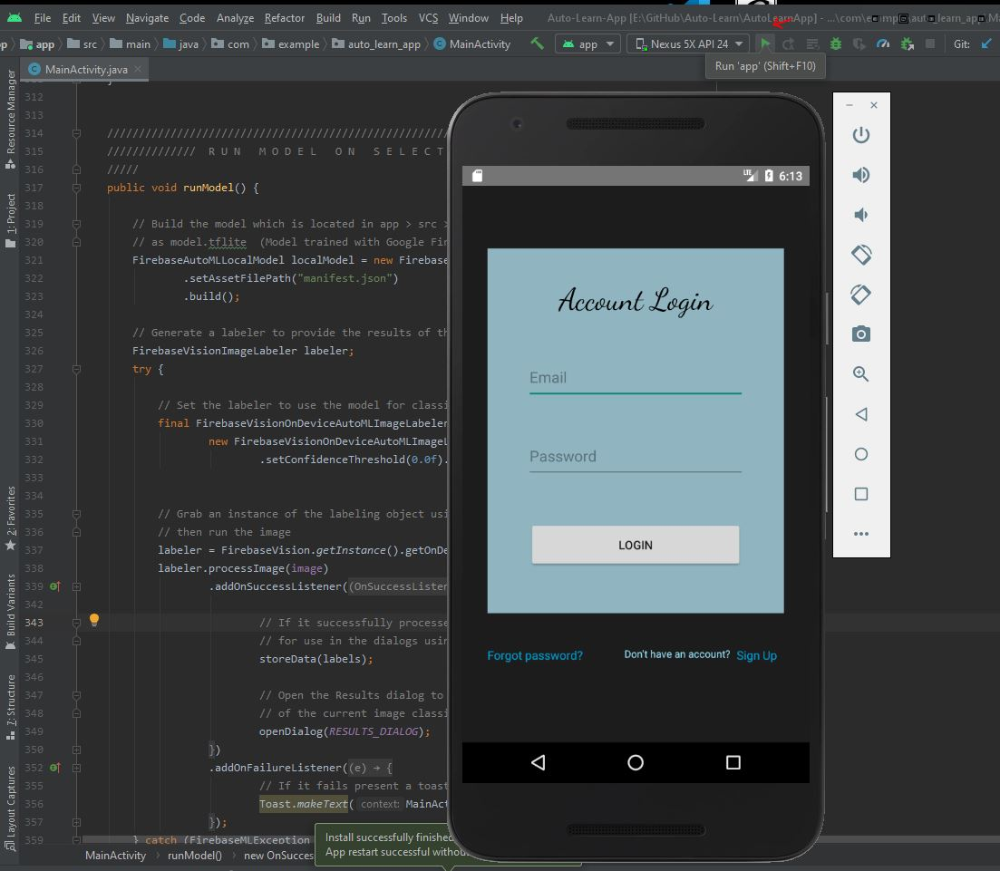

6. For emulated devices the emulator will launch and the Auto-Learn Pro application will be installed    

# Documentation
* **UML diagrams** - located inside of **Increment1_UML**
* **System Requirements Analysis** - located inside of **Increment2_SRA**
* **Test Plan** - located inside of **Increment3_TPL**
* **Final Documentation** - located in **Increment4_Final Binder**

# Machine Learning
### Data Set
Our dataset consists of 5000+ images in a Google Shared Drive folder named [car_images](https://drive.google.com/open?id=1C1nC6vt0jxQ1o0sz7Ioq7MhCGv-PvNNT) which contains six folders representing our **six classifications**.
This is the dataset that was used to train the machine learning model generated by **FirebaseAutoML Vision Edge API**
* [AutoML Vision documentation](https://cloud.google.com/vision/automl/docs)

### Accessing our Machine Learning Code
Contains a google Collab with the code for our custom machine learning model. This model is currently being developed.
Our current work can be found on our [Google Shared Drive](https://drive.google.com/open?id=1_GNGbpxACoNOLmNrdFIqik332ICB5RcJ)

* To get started click on the **autolearn_model.ipynb** in the Shared Drive.

### TF_Model
* **autolearn_model.ipynb** - local copy of the colab (**must use Google Colab**) 
* **labels.txt** - Text file contains the six classifications of vehicles
* **model.tflite** - The current custom model using the code in the Colab
* **model_IO.py** - python script to determine the input for the model in **Android**

